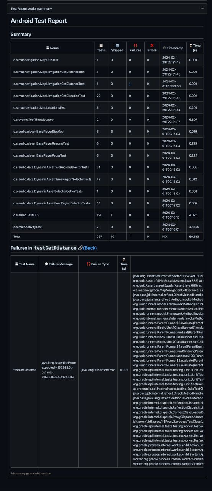

# Android Test Report

This is an GitHub Action that reports Android testing results to [Summary](https://github.blog/2022-05-09-supercharging-github-actions-with-job-summaries/) 

## Usage

```yaml
- name: Report
  uses: FlickerSoul/android-test-report-actions@v1.2
  with:
    working-directory: "./test_data"  # Optional, default to . (current repo directory)
```

## The Report

You would see a result pop up in the Summary for each Action run.


